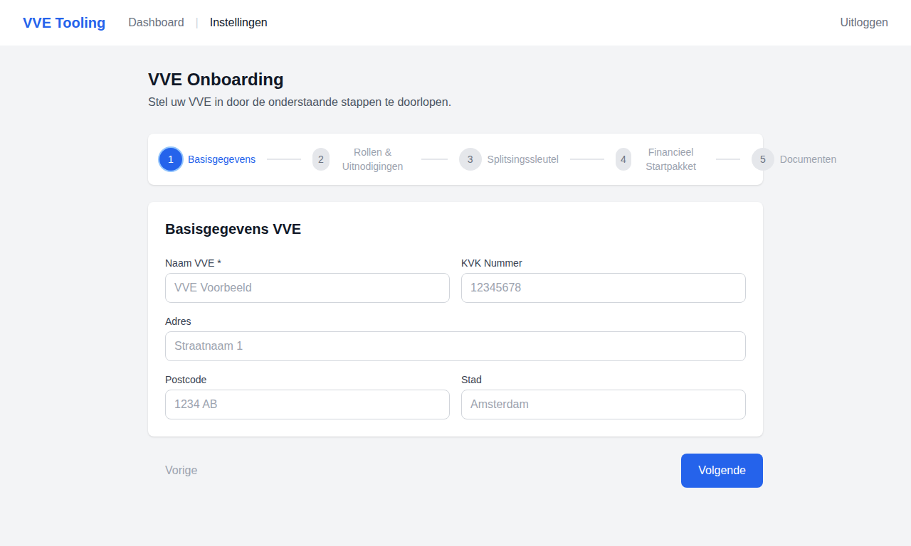
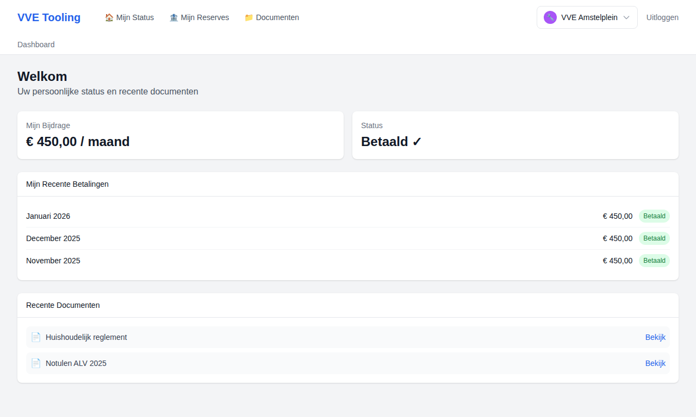
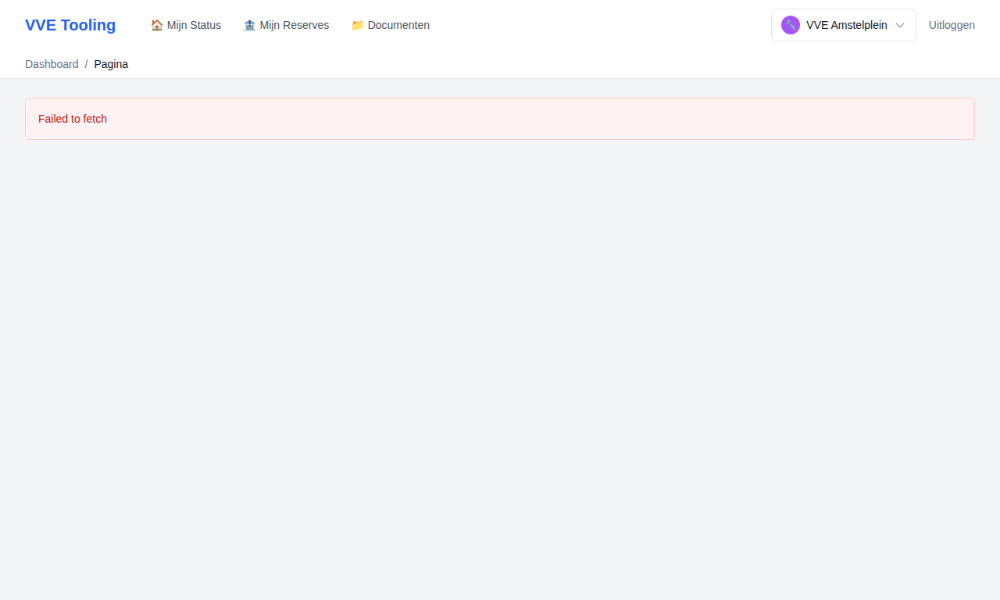
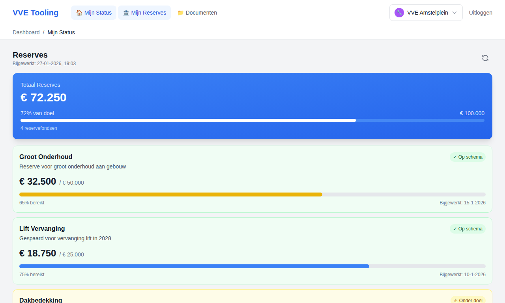
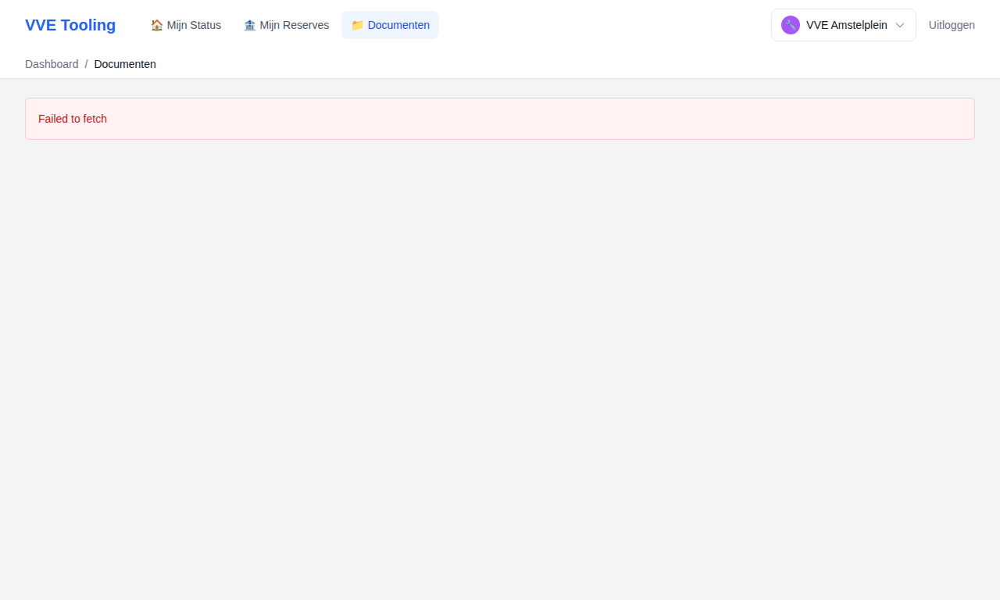
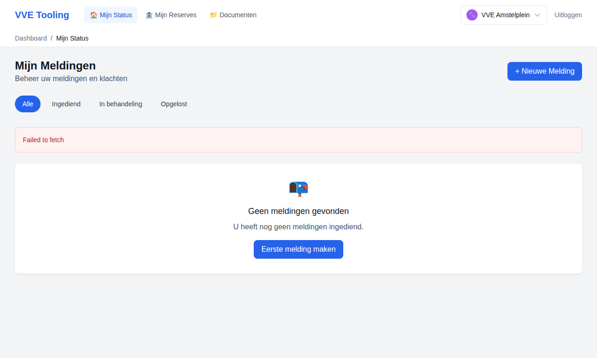
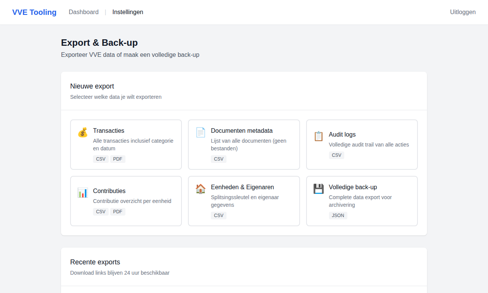

# VVETooling
Tooling om VVE beheer uit te kunnen voeren.

## 🎯 Over dit Project
VVETooling richt zich op het ontwikkelen van moderne, gebruiksvriendelijke software voor het beheer van Verenigingen Van Eigenaren (VVE's) in Nederland.

De focus ligt op:
- **Gebruiksgemak**: Intuïtieve interfaces voor zowel professionals als vrijwilligers
- **Compleet**: Alle aspecten van VVE beheer in één platform
- **Modern**: Cloud-based, mobile-first architectuur
- **Betaalbaar**: Toegankelijke prijzen voor alle segmenten

## ✅ Functionaliteiten
- Rolgebaseerde login & tenant-switcher (bewoner, penningmeester, bestuurslid, beheerder)
- Onboarding wizard met VVE-gegevens, rollen, splitsingssleutel en document-upload
- Dashboards voor bewoners en beheerders met status, meldingen en inzichten
- Financieel beheer: transacties, contributies, reserves en jaarrekening
- Documentbeheer met versiebeheer en audittrail
- Tickets, leveranciersbeheer en communicatie
- Import, export en back-up flows
- E-mailinstellingen en notificaties

## 🖼️ Screenshots
### Login & onboarding



### Dashboard & financiën




### Documenten & service




Meer screenshots en naming conventies vind je in [docs/screenshots/README.md](docs/screenshots/README.md).

## 🛠️ Tech stack
- **Frontend:** Next.js 14, React 18, Tailwind CSS
- **Backend:** FastAPI, SQLAlchemy, Pydantic
- **Database:** PostgreSQL (asyncpg)
- **Integraties:** AWS S3 via boto3 (documentopslag)
- **Testing:** Jest/Testing Library, Pytest

## 🚀 Lokale ontwikkeling

### Backend
```bash
cd backend
cp .env.example .env
python -m pip install -r requirements.txt
uvicorn app.main:app --reload
```
API docs: http://localhost:8000/docs

### Frontend
```bash
cd frontend
npm install
npm run dev
```
App: http://localhost:3000

## 🧪 Tests
```bash
cd backend
pytest
```
```bash
cd frontend
npm test
```

## 📂 Projectstructuur
- `frontend/` - Next.js UI
- `backend/` - FastAPI API + business logic
- `docs/` - Architectuur, product, UX en screenshots

## 📚 Documentatie

### Architectuur
Volledige architecturale documentatie voor VVE Tooling MVP is beschikbaar in de map `docs/architecture/`.

**Start hier**: [Architecture README](docs/architecture/README.md)

De architecturale documentatie omvat:
- **Architecturale Verkenning**: Technische implicaties van productdoelen, aannames en open vragen
- **Architectuurprincipes**: Niet-functionele randvoorwaarden en bewuste keuzes
- **Risico's & Afhankelijkheden**: Technische risico's, complexiteit en impact op planning
- **Constraints**: Technische kaders en vrijheidsgraden voor UX en Development teams

### Product Management
Product documentatie (productrichting, strategie, epics) is beschikbaar in `docs/product/` en `docs/backlog/`.

**Productrichting**: [01-probleemdefinitie-productrichting.md](docs/product/discovery/01-probleemdefinitie-productrichting.md)
**Strategie**: [01-productstrategie-keuzes.md](docs/product/strategy/01-productstrategie-keuzes.md)
**Epics**: [01-mvp-epics.md](docs/backlog/epics/01-mvp-epics.md)

### Marktonderzoek
Uitgebreid marktonderzoek voor VVE Tooling vanuit sales perspectief is beschikbaar in de map `docs/marktonderzoek/`.

**Start hier**: [00-overzicht.md](docs/marktonderzoek/00-overzicht.md)

Het marktonderzoek omvat:
- **Gebruikersonderzoek**: Beheerders, penningmeesters, bestuursleden en eigenaren
- **Markt assen**: Contributie, contracten, onderhoud, financiële administratie, communicatie, juridische zaken en vergaderingen
- **Concurrentie analyse**: Overzicht van de huidige markt en concurrenten
- **Markt kansen**: Geïdentificeerde kansen en strategieën
- **Customer journeys**: Flows vanuit alle gebruikersperspectieven

### UX Discovery
UX onderzoek en vraagstukken zijn beschikbaar in `docs/ux/discovery/`.

**UX Vraagstukken**: [01-ux-vraagstukken-validatie.md](docs/ux/discovery/01-ux-vraagstukken-validatie.md)
