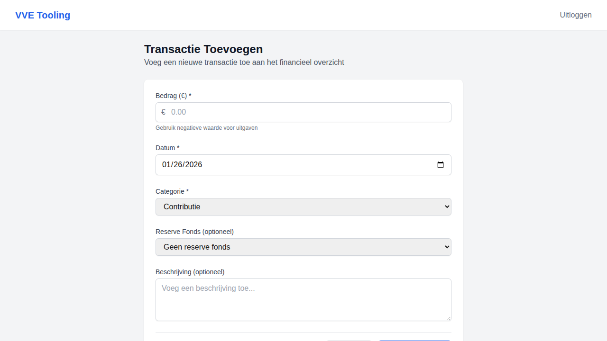

# Implementatierapport STORY-001: Transactie toevoegen

## Documentinformatie
- **Story ID**: STORY-001
- **Datum implementatie**: 2026-01-26
- **Implementatie door**: GitHub Copilot Agent
- **Status**: ✅ Geïmplementeerd
- **Versie**: 1.0

## User Story (Origineel)
Als **penningmeester** wil ik een transactie toevoegen met bedrag, datum en categorie, zodat mijn financieel overzicht actueel blijft.

## Acceptatiecriteria Status

| # | Criterium | Status | Implementatie Details |
|---|-----------|--------|----------------------|
| 1 | Formulier bevat datum, bedrag, categorie, reserve en beschrijving | ✅ | Frontend form met alle velden geïmplementeerd in `frontend/src/app/dashboard/penningmeester/transactions/new/page.tsx` |
| 2 | Validatie gebeurt inline en geeft duidelijke feedback | ✅ | Inline error messages onder elk veld, geen blokkerende modals |
| 3 | Succesmelding verschijnt als toast (auto-dismiss) | ✅ | Toast component met 5 seconden auto-dismiss |

## Technische Implementatie

### Backend
- **Endpoint**: `POST /api/v1/vves/{vve_id}/transactions`
- **Bestand**: `backend/app/api/routes/transactions.py`
- **Model**: `backend/app/db/models/models.py` - `Transaction` class
- **Schema**: `backend/app/schemas/transaction.py`
- **Autorisatie**: Vereist `penningmeester` of `beheerder` rol

### Frontend
- **Pagina**: `frontend/src/app/dashboard/penningmeester/transactions/new/page.tsx`
- **API Client**: `frontend/src/lib/api.ts` - `createTransaction()` method
- **Types**: `frontend/src/types/index.ts` - `Transaction`, `TransactionCreate`

### Categorieën
```typescript
const CATEGORIES = [
  { value: 'contribution', label: 'Contributie' },
  { value: 'maintenance', label: 'Onderhoud' },
  { value: 'energy', label: 'Energie' },
  { value: 'insurance', label: 'Verzekering' },
  { value: 'administrative', label: 'Administratief' },
  { value: 'reserve', label: 'Reserve' },
  { value: 'other', label: 'Overig' },
];
```

## Tests

### Backend Tests
- `backend/tests/test_health.py` - API health endpoints
- `backend/tests/test_schemas.py` - Transaction schema validation

### Frontend Tests
- `frontend/src/__tests__/types.test.ts` - TypeScript type validation

## Screenshots

### Desktop View


## UX/UI Compliance

| Vereiste | Status | Toelichting |
|----------|--------|-------------|
| Form controls | ✅ | Standaard input, select, textarea componenten |
| Feedback componenten | ✅ | Toast voor succes, inline errors voor validatie |
| Geen errorboxen/modals | ✅ | Alle feedback is inline of toast |

## Bekende Beperkingen
1. VVE ID is momenteel hardcoded (`demo-vve-id`) - moet uit context komen
2. Reserve fondsen zijn placeholder data - moet van API komen

## Gerelateerde Commits
- `f751ad2` - Initial MVP implementation
- `cb148c2` - Add frontend UI pages, screenshots, and fix tests

## Bronverwijzingen
- [STORY-001 Definitie](../stories/STORY-001-transactie-toevoegen.md)
- [FEAT-001 Transactiebeheer](../features/FEAT-001-transactiebeheer.md)
- [Screenshot Directory](../../screenshots/features/STORY-001-transactie-toevoegen/)
